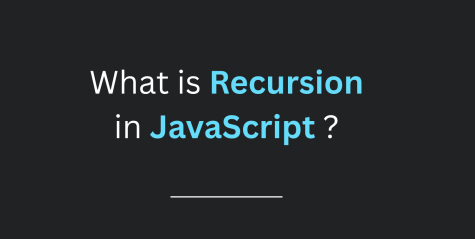
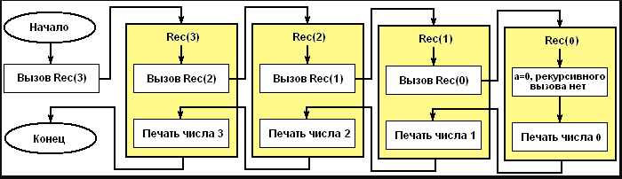
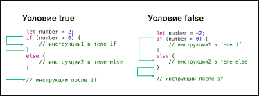
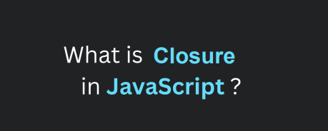
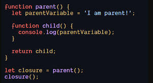
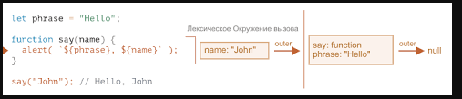
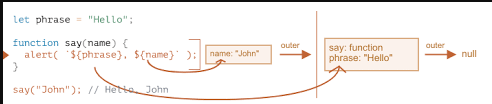
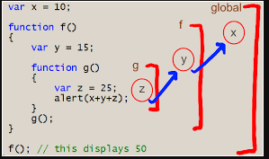

"# home_18" 
# hello

 # рекурсия - это когда функция вызывает себя, пока кто-то ее не остановит. 
 - если его никто не остановит recurse (вызвать себя) навсегда. рекурсивные функции позволяют вам выполнять единицу работы несколько раз.
современные языки программирования, такие как javascript, уже имеют операторы for и while как Альтернативы рекурсивным функциям. но некоторые языки, такие как закрытие, не имеют циклов операторы, поэтому вам нужно использовать рекурсию для многократного выполнения фрагмента кода

# рекурсивная функция должна иметь условие для прекращения вызова самой себя. в противном случае функция вызывается бесконечно.
- Как только условие выполнено, функция перестает вызывать себя. это называется база состояние.
- Чобы предотвратить бесконечную рекурсию, вы можете использовать if. оператор else (или аналогичный подход)где одна ветвь делает рекурсивный - вызов, а другая нет

# closure
- замыкание — это комбинация функции, связанной вместе (приложенной) со ссылками на окружающее его состояние (лексическое окружение). другими - словами, замыкание дает вам доступ к области действия внешней функции из внутренней функции

